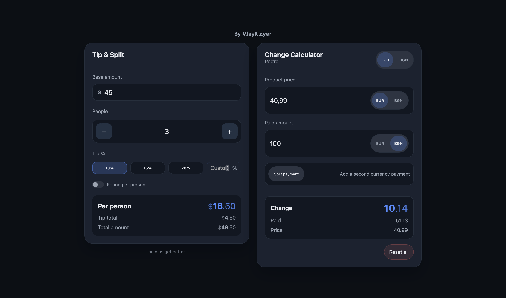

# Minimal Calculator

A calm, minimalist utility calculator built for real-life payments — **tip splitting** and **change calculation** — with a clean, fast UI that works great on both desktop and mobile.

Designed for restaurants, bars, quick group payments, and everyday “how much do we each owe?” moments.

---

## Features

### Tip & Split
- Base amount input (supports `.` and `,` decimals)
- People split
- Tip presets + custom tip %
- Optional “round per person”
- Breakdown:
  - Per-person total
  - Tip total
  - Total amount
- One-tap/click **copy result** + “Copied!” toast
- One-tap **select-all** when focusing inputs (easy overwrite)

### Change Calculator
- Product price + paid amount (supports `.` and `,` decimals, iOS-safe)
- EUR / BGN support
- Optional split payment (second currency payment)
- Automatic change / remaining amount
- One-tap/click **copy result** + “Copied!” toast
- **Reset all** (Change calculator only)
- One-tap **select-all** on inputs

### Mobile-first UX
- **Mobile portrait:** one panel at a time (minimal, distraction-free)
  - Default: Change Calculator
  - Switch panels via **tap on heading** or **swipe left/right**
  - Remembers last active panel
- Desktop / landscape: both panels visible side-by-side

### Look & Feel
- Dark / Light / Auto theme (follows system in Auto)
- Theme cycle via clicking **“By MlayKlayer”**
- Fully responsive layout
- Minimal UI — no ads, no accounts, no clutter

### PWA / Offline
- Installable PWA (Add to Home Screen)
- Offline-first (works after first load)
- Preferences persisted locally (no backend)

---

## Why

Most calculator apps are cluttered, slow, or try to do everything.
This project explores how far a minimalist UI can go while still solving **everyday money problems** quickly and reliably.

---

## Screenshots

### Desktop

### Mobile

---

## Tech

- Vanilla HTML / CSS / JavaScript
- Service Worker (offline-first)
- Web App Manifest (PWA)
- No frameworks, no backend

---

## Feedback

There’s an in-app link: **“help us get better”** → Google Form.

---

## Live

👉 https://mlayklayer.github.io/Calculator/

---

## Status

**Stable** — actively used and iterated.
